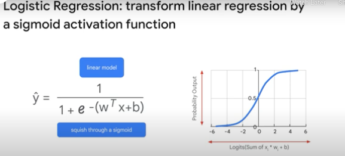
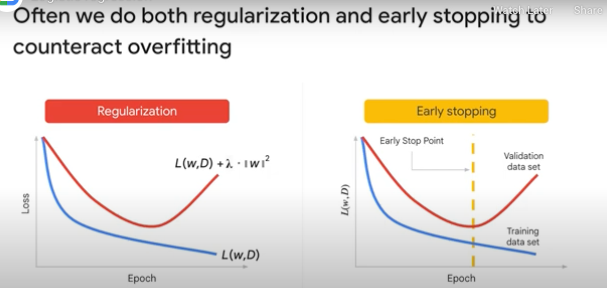
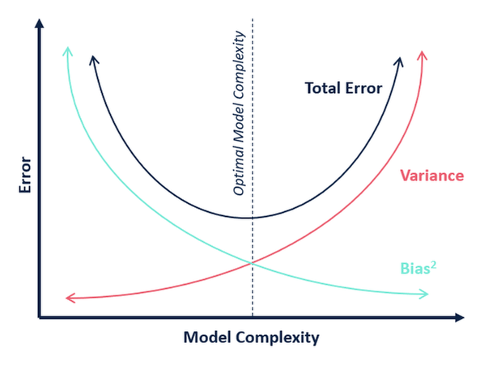
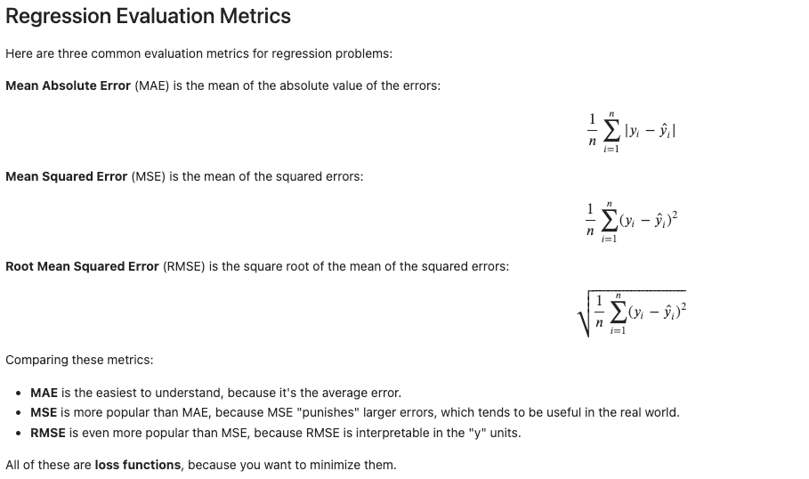

# Intro

## High level types of ML algos

### Supervised

* Regression
* Classification
  * Some models used for classification use-cases:
    * SVMs (Support Vector Machines)
    * Random Forest

### Unsupervised

* Clustering
  * Want to discover the inherent groupings in the data, such as:
    * Grouping customers by purchasing behavior
* Association
  * An Association rule learning problem is where you want to:
    * Discover rules that describe large portions of your data, such as:
      * People that buy X also tend to buy Y
* Models used are:
  * k-means
  * Apriori algorithm for association rule learning problems
  * LDA for topic modelling of text - i.e.:
    * associate key-words to text

### Semi-supervised

* Where some training data is labelled - but a lot of it is not
* Most real-world applications of ML are semi-supervised problems

## ML Models' stuff

### Logistic regression vs. Linear Regression

* Linear Regression
  * Linear regression is used to predict the continuous dependent variable using a given set of independent variables
* Logistic Regression
  * Logistic Regression is used to predict the categorical dependent variable using a given set of independent variables

### Linear Regression
It's basically:
`Y = MX + c`

* Y is a matrix of shape N (where N is the number of samples)
* X is a matrix of shape N x M (where is the number of samples and M is the number of features)
* M is the feature matrix

### Logistic Regression



* The input into the sigmoid function is called the `logit` - and is the output of linear regression
  * Non-linear transformation on our linear model
* Sigmoid function is a accumulated distribution function of the logistic probability distribution


### Terms to learn more about
* Validation-loss function
* Precision vs. Recall
* Back-propogation
* Feature cross
* Cross entropy
* Receiver operating characteristic curve, or ROC


### Regularization

Reference: https://en.wikipedia.org/wiki/Regularization_(mathematics)

* Leads to smaller parameter weights
  * Intuition is to prevent logit output going to +Infinity or -Infinity
* When the logit outputs are going to +/- Infinity, that leads to Saturation and Overfitting
  * Causes training to stop - as the model is now predicting only in the flat sections of the graph
* L1 vs. L2 Regularization
  * L1 Reg. for sparcity?
  * L2 Reg. for keeping model weights small?
  * Examples of Regularization methods:
    * Lasso
    * Ridge Regression
* **Early stopping** (example of Implicit Regularization)
  * Stops training when validation performance deteriorates
    * Thus preventing overfitting by halting before the model memorizes training data.
  * Sometimes used in place of L2 Regularization as it's computationally cheaper
* Hyper-parameter tuning




### Bias-variance trade-off & Over/Under fitting

* Model complexity - the number of features used to model the data
  * Less model complexity can lead to underfitting - i.e. not modelling the data properly
* Variance
  * A model that is too complex can tend to be too specific 
    * Cannot be used to accurately infer anything about unseen data
      * Overfits the training data
      * Cannot be used to make predictions on new data

* High Bias - model doesn't model the data enough
  * What helps:
    * Need a more complex model
* High Variance - model overfits the data
  * What helps:
    * Need more data
    * Regularization




# Reference code and explanations

### Linear Regression

```
# Create X (input) and y (output) arrays
X = df_USAhousing[['Avg. Area Income', 'Avg. Area House Age', 'Avg. Area Number of Rooms',
                   'Avg. Area Number of Bedrooms', 'Area Population']]
y = df_USAhousing['Price']

# Split into train/test datasets
from sklearn.model_selection import train_test_split
X_train, X_test, y_train, y_test = train_test_split(X, y, test_size=0.4, random_state=101)

# Simple Linear Regression
from sklearn.linear_model import LinearRegression
lm = LinearRegression().fit(X, y)

lm.intercept_ # Intercept to the y-axis, unless specified to be centered at y=0 (i'm using 2D examples here)
# `intercept_` is a scalar value

lm.coef_ # is a matrix of size (number_features, 1)

# predictions is a vector of shape (number_samples, 1) 1 in the case of a simple example at least
predictions = lm.predict(X_test)

# Measure error!
from sklearn import metrics
metrics.mean_absolute_error(y_test, predictions) # Returns a scalar
metrics.mean_squared_error(y_test, predictions)) # Returns a scalar
np.sqrt(metrics.mean_squared_error(y_test, predictions)) # Returns a scalar
```

### Cost Functions



```
# Measure error!
from sklearn import metrics
metrics.mean_absolute_error(y_test, predictions) # Returns a scalar
metrics.mean_squared_error(y_test, predictions)) # Returns a scalar
np.sqrt(metrics.mean_squared_error(y_test, predictions)) # Returns a scalar
```